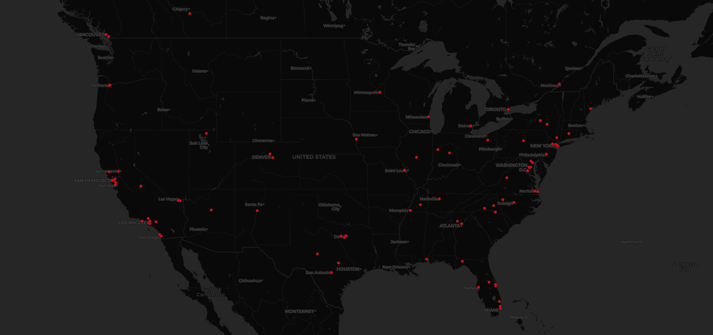

# Tesla - Geocoded  Tweets

The data collection from the Twitter crawler included *173 total geocoded tweets*.
However, my scope is focused on the *United States* to see where the majority of Tesla enthusiasts reside.
There are a total of *119 geocoded tweets in the United States*. Based on the screenshot, the majority of the
tweets come from California or the eastern states. Tweets are usually concentrated in states like California, New York and
Washington D.C. In California, many tweets come from San Francisco, specifically the area of Silicon Valley, and Los Angeles.
In New York, the tweets are concentrated in New York City. In general, the tweets are usually located close to cities. I find it
surprising that there are not any geotagged tweets from Bellevue or even just the state of Washington, since there are two Tesla
shops in Bellevue.